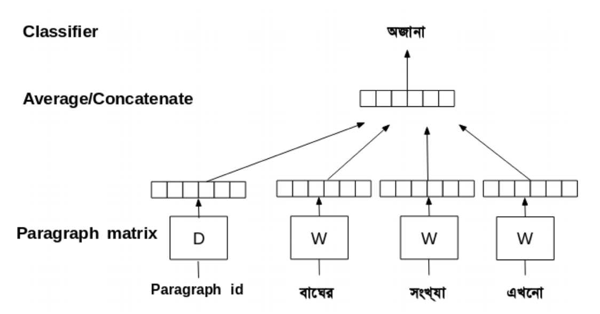
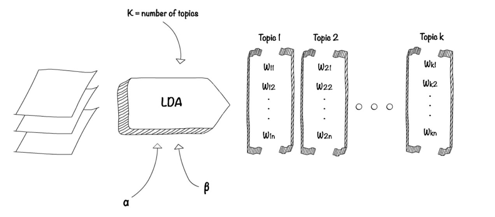
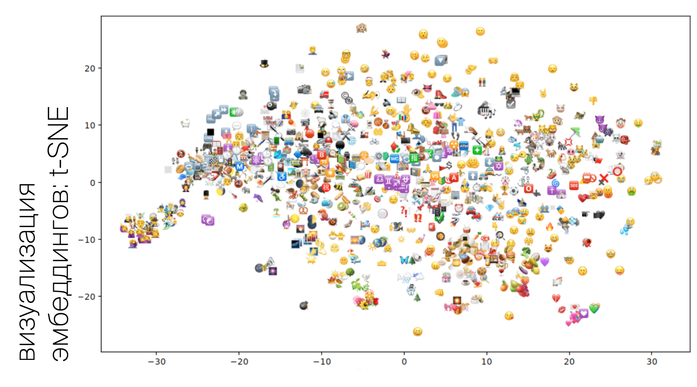

<h1><center>emopok data pipeline 🤔</center></h1>
<center>authors: [Aina Nurmagombetova](https://github.com/anurma) 🤙 [Alina Cherepanova](https://github.com/alinacherepanova) 🙋 [Anya Bataeva](https://github.com/fyzbt) 🤯 [Olya Silyutina](https://github.com/olgasilyutina) 🤩</center>


```python
import emopok
import emoji
import pandas as pd
import numpy as np
import string
import re
from collections import Counter
import nltk
from nltk.corpus import stopwords
from nltk.tokenize import word_tokenize
from gensim.models import word2vec
from gensim.models import Word2Vec
from sklearn.metrics import silhouette_score
from sklearn.cluster import KMeans
import os
import glob
import json
from tqdm import tqdm_notebook as tqdm
import warnings
warnings.filterwarnings('ignore')
```


```python
# loading df with twitter and telegram data
df = pd.read_csv('./data/new_df_twi_tg.csv')
df['new_id'] = df.groupby(df.texts.tolist(), sort=False).ngroup() + 1
df_subset = df[['texts', 'new_id']]
unique_df = df_subset.drop_duplicates()
```


```python
df[['texts', 'emoji', 'new_id']].to_csv("./data/emoji_texts_df.csv", header=['texts', 'emoji', 'index'], index = False)
```


```python
unique_df.to_csv("./data/unique_emopok.csv", header=['texts', 'index'], index = False)
```


```python
# text preprocessing and writing into csv file
emopok.preprocess_text(unique_df['texts'], unique_df['new_id'])
```


```python
clean_data = pd.read_csv('./data/clean_text.csv')
```

## 😭 sentiments 😂


[William L. Hamilton, Kevin Clark, Jure Leskovec, and Dan Jurafsky. Inducing Domain-Specific Sentiment Lexicons from Unlabeled Corpora. Proceedings of EMNLP. 2016. (to appear; arXiv:1606.02820).](https://github.com/williamleif/socialsent)


```python
# create list of sentences for word2vec model
w2v_sentences = [nltk.word_tokenize(str(i)) for i in tqdm(clean_data['clean_texts'])]
```


    HBox(children=(IntProgress(value=0, max=357077), HTML(value='')))


```python
# creating the model and setting values for the various parameters
num_features = 100  # Word vector dimensionality
min_word_count = 5 # Minimum word count
num_workers = 4     # Number of parallel threads
context = 5       # Context window size
iterations = 20
```


```python
w2v_model = emopok.train_word2vec(w2v_sentences, num_workers, num_features, min_word_count, context, iterations, \
                                  file_path = './models/emopok_w2v_model')
```


```python
w2v_model = Word2Vec.load("./models/emopok_w2v_model")
```


```python
w2v_model.similar_by_word('привет')
```


    [('приветик', 0.7054356336593628),
     ('апрелька', 0.49257901310920715),
     ('привееет', 0.4709334373474121),
     ('делишки', 0.4653734862804413),
     ('тезка', 0.4564298689365387),
     ('весточка', 0.4510449171066284),
     ('сестричка', 0.4470579922199249),
     ('шмуль', 0.4408361613750458),
     ('приветствие', 0.4390951693058014),
     ('денисовна', 0.43712013959884644)]


```python
# get stats on word counts
flat_sentences = [item for sublist in w2v_sentences for item in sublist]
words_count = Counter(flat_sentences)
words_count = pd.DataFrame.from_dict(words_count, orient='index').reset_index()
```


```python
# get input file for socialsent
words_count.columns = ['lem_word', 'count']
words = []
vectors = []
for word in tqdm(words_count['lem_word']):
    try:
        vectors.append(list(w2v_model[word]))
        words.append(word)
    except:
        Exception
```


    HBox(children=(IntProgress(value=0, max=135713), HTML(value='')))


```python
# save word2vec output to txt file for socialsent
# script for sentiment analysis is here https://github.com/olgasilyutina/socialsent3/blob/master/example.ipynb
data_vect = pd.DataFrame(vectors, columns=list(range(num_features)))
data_vect.index = words
data_vect['lem_word'] = words
data_vect = data_vect.drop('lem_word', axis = 1).reset_index()
data_vect.to_csv('./data/data_emopok.txt', header = None, index = None, sep = ' ', mode = 'w')
```


```python
# load results of socialsent model
sent_dfs = []

for file in glob.glob("./data/polarities/*.json"):
    with open( file) as f:
        data = json.load(f)
    sent_dfs.append(pd.DataFrame(data, index=[0]).T.reset_index())

sent_df = pd.concat(sent_dfs)
sent_df.columns = ['word', 'sent']
sent_df = sent_df.reset_index().drop('index', axis=1).drop_duplicates()
sent_df = sent_df[sent_df['sent'] != 0]
```


```python
# calcelate sentiments for every text
df_sent = pd.DataFrame({'doc': w2v_sentences})
df_sent = df_sent.reset_index()
df_sent['index'] = df_sent['index'] + 1
df_sent = df_sent.set_index(['index'])['doc'].apply(pd.Series).stack()
df_sent = df_sent.reset_index()
df_sent = df_sent.drop('level_1', axis=1)
df_sent.columns = ['index', 'word']
df_sent = df_sent.merge(sent_df, on=['word'], how='left')
```


```python
df_sent = pd.DataFrame(df_sent.groupby('index').sent.sum()).reset_index()
```


```python
df_sent.columns = ['new_id', 'sent']
df_sent_texts = df_sent.merge(unique_df, on = 'new_id')
pd.merge(df_sent, unique_df, how='inner', left_on=['index'], right_on=['new_id'])
df_sent_texts.to_csv('./data/sentiments_emopok.csv', header=['index', 'sent', 'texts'], index = False)
```

## 👷 text features 👷‍♀️


```python
# get text features
textfeatures_df = []
for text, index in tqdm(zip(unique_df['texts'], unique_df['new_id'])):
    textfeatures_df.append(emopok.textfeatures(text, index))
```


    HBox(children=(IntProgress(value=1, bar_style='info', max=1), HTML(value='')))


```python
textfeatures_df = pd.concat(textfeatures_df)
```


```python
textfeatures_df.describe()
```


<div>
<style scoped>
    .dataframe tbody tr th:only-of-type {
        vertical-align: middle;
    }

    .dataframe tbody tr th {
        vertical-align: top;
    }

    .dataframe thead th {
        text-align: right;
    }
</style>
<table border="1" class="dataframe">
  <thead>
    <tr style="text-align: right;">
      <th></th>
      <th>index</th>
      <th>n_chars</th>
      <th>n_commas</th>
      <th>n_digits</th>
      <th>n_exclaims</th>
      <th>n_hashtags</th>
      <th>n_lowers</th>
      <th>n_mentions</th>
      <th>n_urls</th>
      <th>n_words</th>
      <th>n_nonasciis</th>
      <th>n_uppers</th>
    </tr>
  </thead>
  <tbody>
    <tr>
      <th>count</th>
      <td>357077.000000</td>
      <td>357077.000000</td>
      <td>357077.000000</td>
      <td>357077.000000</td>
      <td>357077.000000</td>
      <td>357077.000000</td>
      <td>357077.000000</td>
      <td>357077.000000</td>
      <td>357077.000000</td>
      <td>357077.000000</td>
      <td>357077.000000</td>
      <td>357077.000000</td>
    </tr>
    <tr>
      <th>mean</th>
      <td>178539.000000</td>
      <td>70.611608</td>
      <td>0.657847</td>
      <td>1.122324</td>
      <td>0.183358</td>
      <td>0.053823</td>
      <td>50.520840</td>
      <td>0.604973</td>
      <td>0.179992</td>
      <td>26.987843</td>
      <td>45.531244</td>
      <td>4.089048</td>
    </tr>
    <tr>
      <th>std</th>
      <td>103079.395373</td>
      <td>74.893091</td>
      <td>1.272483</td>
      <td>5.267934</td>
      <td>0.864982</td>
      <td>0.339021</td>
      <td>53.307267</td>
      <td>1.564861</td>
      <td>0.446786</td>
      <td>36.221020</td>
      <td>51.563273</td>
      <td>8.583359</td>
    </tr>
    <tr>
      <th>min</th>
      <td>1.000000</td>
      <td>0.000000</td>
      <td>0.000000</td>
      <td>0.000000</td>
      <td>0.000000</td>
      <td>0.000000</td>
      <td>0.000000</td>
      <td>0.000000</td>
      <td>0.000000</td>
      <td>1.000000</td>
      <td>0.000000</td>
      <td>0.000000</td>
    </tr>
    <tr>
      <th>25%</th>
      <td>89270.000000</td>
      <td>26.000000</td>
      <td>0.000000</td>
      <td>0.000000</td>
      <td>0.000000</td>
      <td>0.000000</td>
      <td>18.000000</td>
      <td>0.000000</td>
      <td>0.000000</td>
      <td>8.000000</td>
      <td>14.000000</td>
      <td>1.000000</td>
    </tr>
    <tr>
      <th>50%</th>
      <td>178539.000000</td>
      <td>49.000000</td>
      <td>0.000000</td>
      <td>0.000000</td>
      <td>0.000000</td>
      <td>0.000000</td>
      <td>34.000000</td>
      <td>0.000000</td>
      <td>0.000000</td>
      <td>20.000000</td>
      <td>29.000000</td>
      <td>2.000000</td>
    </tr>
    <tr>
      <th>75%</th>
      <td>267808.000000</td>
      <td>90.000000</td>
      <td>1.000000</td>
      <td>1.000000</td>
      <td>0.000000</td>
      <td>0.000000</td>
      <td>65.000000</td>
      <td>1.000000</td>
      <td>0.000000</td>
      <td>35.000000</td>
      <td>58.000000</td>
      <td>4.000000</td>
    </tr>
    <tr>
      <th>max</th>
      <td>357077.000000</td>
      <td>4056.000000</td>
      <td>115.000000</td>
      <td>1492.000000</td>
      <td>62.000000</td>
      <td>21.000000</td>
      <td>3154.000000</td>
      <td>50.000000</td>
      <td>23.000000</td>
      <td>3474.000000</td>
      <td>3276.000000</td>
      <td>511.000000</td>
    </tr>
  </tbody>
</table>
</div>


```python
textfeatures_df.to_csv('./data/textfeatures_emopok.csv', index = False)
```

## 👉 doc2vec 👈



[Quoc Le, Tomas Mikolov Distributed Representations of Sentences and Documents, Proceedings of the 31 st International Conference on Machine
Learning. 2014](https://cs.stanford.edu/~quocle/paragraph_vector.pdf)


```python
# preprocess text doc2vec representations
preprocess_text(unique_df['texts'], unique_df['new_id'], lemmatize = True, stopwords = False, \
                russian_only = False, file_path = './data/d2v_clean_data.csv')
```


```python
d2v_clean_data = pd.read_csv('./data/d2v_clean_data.csv')
```


```python
# create list of sentences for doc2vec model
d2v_sentences = [nltk.word_tokenize(str(i)) for i in tqdm(d2v_clean_data['clean_texts'])]
```


    HBox(children=(IntProgress(value=0, max=357077), HTML(value='')))


```python
d2v_model, all_vectors = emopok.train_doc2vec(d2v_sentences, 100, 5, 10, 5, save_model_to = './models/emopok_d2v_model')
```


    HBox(children=(IntProgress(value=1, bar_style='info', max=1), HTML(value='')))


    Model was successfully saved with a name  ./models/emopok_w2v_model


```python
all_vectors_df = pd.DataFrame(all_vectors)
all_vectors_df.columns = ['d2v_' + str(col) for col in all_vectors_df.columns]
```


```python
all_vectors_df.to_csv('./data/d2v_vectors_emopok.csv', index = False)
```

## 🤖 LDA 👀



[Blei D. M., Ng A. Y., Jordan M. I. Latent dirichlet allocation //Journal of machine Learning research. – 2003. – Т. 3. – №. Jan. – С. 993-1022.](http://www.cs.columbia.edu/~blei/papers/BleiNgJordan2003.pdf)


```python
num_topics = 20
sentences = w2v_sentences
corpus = emopok.get_lda_model(sentences, num_topics, file_path = './models/emopok_lda_model')
```


```python
lda_model_emo = emopok.load("./models/emopok_lda_model")
```


```python
topics_df = emopok.get_topics_for_docs(corpus, lda_model_emo, 20, unique_df['texts'])
```


```python
topics_df = pd.read_csv('./data/topics_df.csv')
```


```python
dum_topics = pd.get_dummies(topics_df['topic'])
dum_topics.columns = ['topic_' + str(col) for col in dum_topics.columns]
```


```python
dum_topics.to_csv('./data/dum_topics_emopok.csv', index = False)
```

## 🌈 emoji clusterization 🌈




```python
emoji_texts = []
unique_emojies = list(df.emoji.unique())

for text in tqdm(unique_df['texts']):
    emoji_texts.append(emopok.get_emoji_sentences(text, unique_emojies))
```


    HBox(children=(IntProgress(value=0, max=357077), HTML(value='')))


```python
# creating the model and setting values for the various parameters
num_features = 1000  # Word vector dimensionality
min_word_count = 50 # Minimum word count
num_workers = 4     # Number of parallel threads
context = 2       # Context window size
iterations = 20

w2v_emoji_model = emopok.train_word2vec(emoji_texts, num_workers, num_features, min_word_count, context, iterations, \
                           file_path = './models/emopok_w2v_emoji_model')
```

    Model was successfully saved with a name  ./models/emopok_w2v_emoji_model


```python
w2v_emoji_model = Word2Vec.load("./models/emopok_w2v_emoji_model")
```


```python
w2v_emoji_model.similar_by_word('💞')
```


    [('💝', 0.8745415210723877),
     ('💟', 0.8650382161140442),
     ('💘', 0.8625384569168091),
     ('💓', 0.8616468906402588),
     ('💖', 0.830069899559021),
     ('❣', 0.8249319791793823),
     ('💗', 0.8223015069961548),
     ('💕', 0.8110256195068359),
     ('💌', 0.787800669670105),
     ('💋', 0.7590600252151489)]


```python
unique_emojies = df.groupby('emoji').texts.count().reset_index().sort_values('texts')
unique_emojies = unique_emojies[unique_emojies['texts'] >= 50].emoji.tolist()
```


```python
emojis_found = [e for e in unique_emojies if e in w2v_emoji_model.wv.vocab]
X = [w2v_emoji_model.wv[e] for e in unique_emojies if e in w2v_emoji_model.wv.vocab]

emopok.search_for_kmeans(30, X)
```


```python
emo_clusters = emopok.train_kmeans(26, X, emojis_found, save_to = './data/emopok_clusters.csv')
```


```python
# cluster 15 and 16 clusters separately
emo_clusters = pd.read_csv('./data/emopok_clusters.csv')
emo_clusters = emo_clusters.astype(str)
cluster = '15'
unique_emojies = emo_clusters[emo_clusters.cluster_group == cluster]['index'].tolist()
```


```python
emojis_found = [e for e in unique_emojies if e in w2v_emoji_model.wv.vocab]
X = [w2v_emoji_model.wv[e] for e in unique_emojies if e in w2v_emoji_model.wv.vocab]

emopok.search_for_kmeans(15, X)
```


```python
emo_clusters = emopok.train_kmeans(12, X, emojis_found, save_to = f'./data/emopok_clusters_{cluster}.csv')
```


```python
for i in list(emo_clusters[['cluster_group']].drop_duplicates()['cluster_group']):
    print(emo_clusters[emo_clusters.cluster_group == i])
```


```python
emo_clusters = pd.read_csv('./data/emopok_clusters.csv')
emo_clusters = emo_clusters[~emo_clusters['cluster_group'].isin([15, 16])]
```


```python
emo_clusters_15 = pd.read_csv('./data/emopok_clusters_15.csv')
emo_clusters_15['cluster_group'] = '15_' + emo_clusters_15['cluster_group'].astype(str)
```


```python
emo_clusters_16 = pd.read_csv('./data/emopok_clusters_16.csv')
emo_clusters_16['cluster_group'] = '16_' + emo_clusters_16['cluster_group'].astype(str)
```


```python
emo_clusters = pd.concat([emo_clusters, emo_clusters_15, emo_clusters_16])
```


```python
emo_clusters.to_csv('./data/emopok_clusters.csv', index = False)
```


```python
emo_clusters.groupby('cluster_group').count().reset_index().sort_values('index', ascending = False)
```
